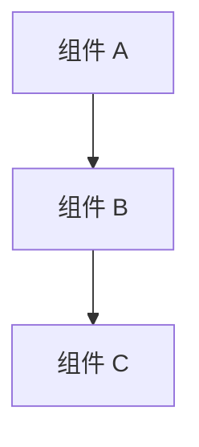
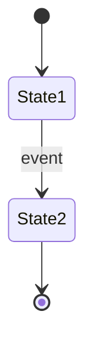

# Phase 2: Architecture（架构设计）

> **目的**: 定义系统的整体结构、组件划分和数据流
> **输入**: Phase 1 PRD
> **输出物**: 填写完成的本文档，存放到 `<project>/docs/02-architecture.md`

---

## 2.1 系统概览（必填）

### 一句话描述
> 这个系统是什么？

### 产品维度评分 (借鉴 gstack CEO Review)

从 10 个维度评估产品设计，每个维度 0-10 分，目标是找到 10-star 产品：

| 维度 | 评分 (0-10) | 什么是 10 分？ | 当前差距 |
|------|------------|---------------|---------|
| **用户价值** | | 解决核心痛点，用户愿意付费 | |
| **简洁性** | | 功能最少但足够，无冗余 | |
| **直观性** | | 用户无需解释就能上手 | |
| **可靠性** | | 零故障，极端情况也能工作 | |
| **性能** | | 比用户期望更快 | |
| **安全性** | | 默认安全，用户无感知 | |
| **可扩展性** | | 今天能用，100x 用户也能用 | |
| **可维护性** | | 新开发者 1 天能贡献代码 | |
| **体验一致性** | | 跨平台/模块体验统一 | |
| **情感连接** | | 用户喜欢用它，愿意推荐 | |

**平均分**: ___ / 10

**最高优先级改进**: 

### 架构图
> 用 mermaid 或 ASCII 画出组件关系图



### 工程审查锁定项 (借鉴 gstack Eng Review)

在继续前，确保以下工程决策已锁定：

| 决策项 | 决定 | 理由 | 状态 |
|--------|------|------|------|
| **技术栈** | | | ⬜ |
| **数据流模式** | | | ⬜ |
| **状态管理方案** | | | ⬜ |
| **错误处理策略** | | | ⬜ |
| **测试策略** | | | ⬜ |
| **部署方案** | | | ⬜ |
| **监控/告警方案** | | | ⬜ |
| **回滚策略** | | | ⬜ |

## 2.2 组件定义（必填）

> 列出所有组件，明确每个组件的职责边界

| 组件 | 职责 | 技术选型 | 状态 |
|------|------|---------|------|
| | 做什么 / 不做什么 | 语言/框架 | 新建/已有 |

## 2.3 数据流（必填）

> 描述核心数据从输入到输出的完整路径

```
用户操作 → 组件 A → 组件 B → 存储 → 组件 C → 用户看到结果
```

### 核心数据流

| 步骤 | 数据 | 从 | 到 | 格式 |
|------|------|----|----|------|
| 1 | | | | |
| 2 | | | | |

## 2.4 依赖关系（必填）

### 内部依赖
> 本项目组件之间的依赖

```
组件 A → 组件 B（调用 B 的 API）
组件 B → 组件 C（读取 C 的数据）
```

### 外部依赖
> 依赖的外部系统/库/服务

| 依赖 | 版本 | 用途 | 是否可替换 |
|------|------|------|-----------|
| | | | |

## 2.5 状态管理（必填）

> 系统中有哪些状态？谁拥有状态？状态如何变化？

### 状态枚举

| 状态名 | 含义 | 谁拥有 | 持久化方式 |
|--------|------|--------|-----------|
| | | | 链上/数据库/内存/文件 |

### 状态转换图（如适用）



## 2.6 接口概览（必填）

> 组件对外暴露的接口概览（详细定义在 Phase 3 技术规格）

| 接口 | 类型 | 调用方 | 说明 |
|------|------|--------|------|
| | RPC/REST/Event/SDK | | |

## 2.7 代理可读性设计 (Agent-Legible Architecture)（必填）

> **核心理念**: 你的代码库是代理的基础设施，应该按这个思路设计它。
> 代理靠模式匹配工作——给它们值得匹配的好模式。

### 设计原则检查

| 原则 | 当前状态 | 改进计划 |
|------|---------|---------|
| **模块化 + 清晰边界** — 代理能在某个区域工作而不污染其他部分 | | |
| **已知模式和约定** — 一致的命名、结构、错误处理模式 | | |
| **核心简单，复杂度推到外层** — 核心逻辑不依赖外围复杂性 | | |
| **无隐藏魔法** — 代理看不到或理解不了的约束，就无法遵守 | | |

### 代理擅长 vs 挣扎的区域

根据架构识别哪些部分适合代理独立工作，哪些需要人类主导：

| 架构区域 | 代理适合度 | 原因 |
|---------|-----------|------|
| 问题空间清晰、API 紧凑、约束严格的模块 | ✅ 高 | 边界明确，代理能独立完成 |
| 跨切面关注点（feature flags、权限、计费） | ⚠️ 低 | 无单一模块拥有，上下文窗口装不下全貌 |
| 核心稳定、易插拔的组件 | ✅ 高 | 文档良好的接口，代理可以对着接口编程 |
| 涉及多个服务状态交互的长期系统 | ⚠️ 低 | 局部合理但全局不一致的风险高 |

### 机械强制规则 (Agent Guardrails)

> 通过工具链把护栏硬编码进流程，而非依赖代理或人类的自律。

根据项目技术栈，定义必须通过 linter/CI 强制执行的规则：

| 规则 | 强制方式 | 为什么 |
|------|---------|--------|
| 禁止裸 catch-all 异常处理 | ESLint / Clippy 规则 | 失败应向上传播，不应被静默吞噬 |
| 禁止抽象层外写 raw SQL | Lint 规则 / 架构测试 | 数据访问必须通过统一抽象层 |
| UI 禁止 raw input 字段 | 组件库 lint 规则 | 必须使用设计系统组件 |
| 禁止 dynamic imports（如适用） | Bundler 配置 | 防止运行时不可预测的依赖 |
| 函数名唯一性检查（如适用） | 自定义 lint 规则 | 防止代理产生重复函数 |
| _（根据项目补充）_ | | |

## 2.8 安全考虑（必填）

| 威胁 | 影响 | 缓解措施 |
|------|------|---------|
| | | |

## 2.9 性能考虑（可选）

| 指标 | 目标 | 约束 |
|------|------|------|
| 吞吐量 | | |
| 延迟 | | |
| 并发 | | |

## 2.10 部署架构（可选）

> 在什么环境运行？怎么部署？

---

## ✅ Phase 2 验收标准

- [ ] 架构图清晰，组件边界明确
- [ ] 所有组件的职责已定义
- [ ] 数据流完整，无断点
- [ ] 依赖关系（内部 + 外部）已列出
- [ ] 状态管理方案已定义
- [ ] 接口已概览（不需要详细，那是 Phase 3 的事）
- [ ] 安全威胁已识别

**验收通过后，进入 Phase 3: Technical Spec →**
