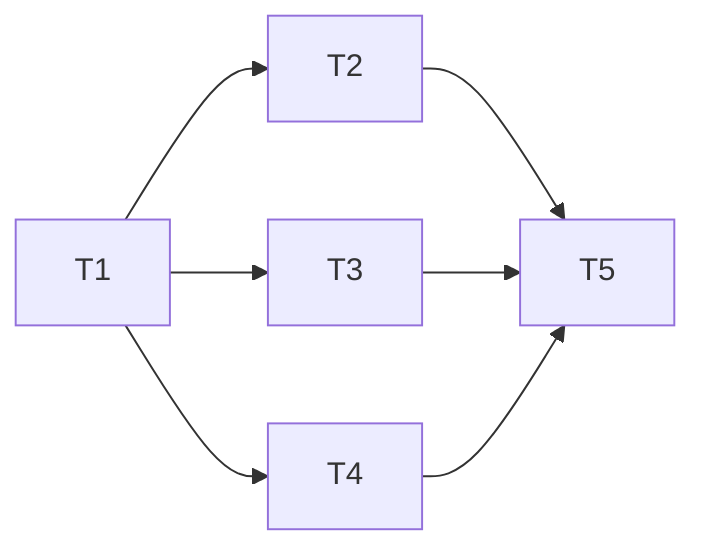

# Phase 4: Task Breakdown（任务拆解）

> **目的**: 将技术规格拆解为可执行、可分配、可验收的独立任务
> **输入**: Phase 3 技术规格
> **输出物**: 任务列表，存放到 `<project>/docs/04-task-breakdown.md`

---

## 4.1 拆解原则

1. **每个任务 ≤ 4 小时**（如果超过，继续拆）
2. **每个任务有明确的 Done 定义**（可验证）
3. **任务之间的依赖关系必须标明**
4. **先基础后上层**（按依赖顺序排列）

## 4.2 任务列表（必填）

### 任务属性说明

| 属性 | 说明 |
|------|------|
| **任务名称** | 简洁描述，动词开头 |
| **描述** | 具体要做什么 |
| **依赖** | 前置任务编号，"无" 表示无依赖 |
| **类型** | 串行 / 并行（见 4.3 节） |
| **预估时间** | 单人完成时间（小时） |
| **优先级** | P0（必须有）/ P1（应该有）/ P2（可以有） |
| **Done 定义** | 可验证的完成标准 |

### 任务列表

| # | 任务名称 | 描述 | 依赖 | 类型 | 预估时间 | 优先级 | Done 定义 |
|---|---------|------|------|------|---------|--------|----------|
| T1 | | | 无 | 串行 | h | P0 | 当 X 时，Y 成立 |
| T2 | | | T1 | 并行 | h | P0 | |
| T3 | | | T1 | 并行 | h | P1 | |

## 4.3 任务执行模式

### 串行任务（Sequential）

**适用场景**: 任务间有强依赖，必须按顺序执行

**执行方式**: 一个任务完成后，才能开始下一个

### 并行任务（Parallel - Coordinator 模式）

**适用场景**: 多个独立子任务可以同时进行，需要 Coordinator 协调

**典型并行任务组**:

| Agent 类型 | 职责 | 输出 |
|-----------|------|------|
| **Research Agent** | 调研现有代码、第三方库 | 调研报告 |
| **Implementation Agent** | 编写核心代码 | 代码变更 |
| **Verification Agent** | 对抗性测试（只读） | 测试报告 |
| **Docs Agent** | 更新文档 | 文档变更 |

**Coordinator 协调流程**:

```
1. 启动: Coordinator 创建所有子 Agent
2. 并行执行: 各 Agent 独立工作
3. 结果汇总: Coordinator 整合所有输出
4. 冲突解决: 如有冲突，重新分配任务
```

**示例并行任务**:
```
T2-Research: 调研现有支付模块实现 (并行)
T3-Impl: 实现新的支付接口 (并行)  
T4-Docs: 编写 API 文档 (并行)
依赖: T1 → [T2, T3, T4] 同时启动
```

## 4.4 任务依赖图（必填）



**说明**: 
- 实线箭头表示串行依赖
- 虚线可表示并行组（T2, T3, T4 同时启动）

## 4.4 里程碑划分（必填）

> 将任务分组为里程碑。每个里程碑是一个可演示的交付物。

### Milestone 1: [名称]
**预计完成**: 日期
**交付物**: 什么可以演示

包含任务: T1, T2, T3

### Milestone 2: [名称]
...

## 4.5 风险识别（必填）

| 风险 | 概率 | 影响 | 缓解措施 |
|------|------|------|---------|
| | 高/中/低 | 高/中/低 | |

---

## ✅ Phase 4 验收标准

- [ ] 每个任务 ≤ 4 小时
- [ ] 每个任务有 Done 定义
- [ ] 依赖关系已标明，无循环依赖
- [ ] 至少划分为 2 个里程碑
- [ ] 风险已识别

**验收通过后，进入 Phase 5: Test Spec →**
